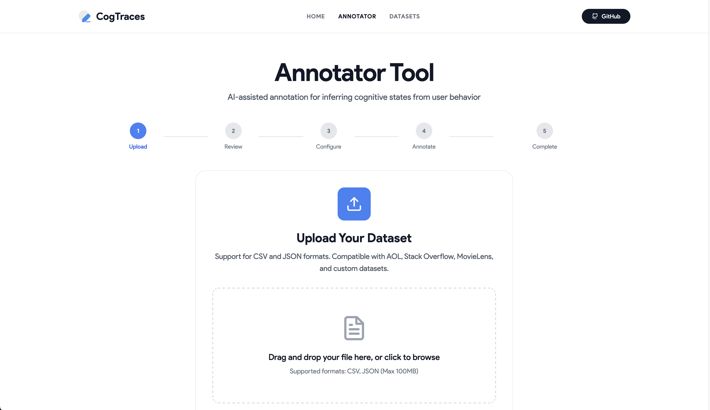

# Beyond the Click: A Framework for Inferring Cognitive Traces in Search

[](https://traces.searchsim.org)

[](https://arxiv.org)
[](https://traces.searchsim.org)
[](LICENSE)

This repository contains the source code, datasets, and tools for the paper **Beyond the Click: A Framework for Inferring Cognitive Traces in Search**.

---

## Abstract

> User simulators are essential for evaluating search systems, but they primarily copy user actions without understanding the underlying thought process. This gap exists because large-scale interaction logs record what users do, but not what they might be thinking or feeling, such as confusion or satisfaction. To solve this problem, we present a new framework that computationally infers cognitive traces from behavioral data. Our method uses a multi-agent language model system, grounded in Information Foraging Theory and calibrated by human experts, to annotate user actions with their likely cognitive state. To show the value of these traces, we demonstrate that they significantly improve a model's ability to predict when a user will abandon a search task. We release a collection of annotations for several public datasets, including AOL and Stack Overflow, and an open-source tool that allows researchers to apply our method to their own data. This work provides the tools and data needed to build more human-like user simulators and to assess retrieval systems on user-oriented dimensions of performance.

**Keywords**: *User Simulation • Cognitive Modeling • Information Retrieval • Data Annotation • Large Language Models*

---

## Table of Contents

- [Overview](#overview)
- [What Are Cognitive Traces?](#what-are-cognitive-traces)
- [Resources](#resources)
  - [Cognitive Annotation Collection](#cognitive-annotation-collection)
  - [The Annotator Tool](#the-annotator-tool)
  - [Pre-Trained Model](#pre-trained-model)
- [Installation](#installation)
  - [Backend Setup](#backend-setup)
  - [Frontend Setup](#frontend-setup)
  - [Docker Setup](#docker-setup)
- [Usage](#usage)
  - [Running the Annotator Tool](#running-the-annotator-tool)
  - [API Usage](#api-usage)
  - [Standalone Model Usage](#standalone-model-usage)
- [Cognitive Label Schema](#cognitive-label-schema)
- [Multi-Agent Framework](#multi-agent-framework)
- [Experimental Validation](#experimental-validation)
- [Data Format](#data-format)
- [Repository Structure](#repository-structure)
- [Citation](#citation)
- [License](#license)
- [Contact](#contact)

---

## Overview

This repository provides a complete framework for inferring cognitive traces from user behavior logs. Our approach bridges the gap between observable user actions (clicks, queries, ratings) and unobservable mental states (confusion, satisfaction, information scent).

### Key Features

- **Theory-Grounded**: Based on Information Foraging Theory (IFT) principles
- **Computationally Scalable**: Uses a multi-agent LLM system for large-scale annotation
- **Validated by Experts**: Human-in-the-loop verification with high inter-annotator agreement (α=0.78)
- **Reproducible**: All code, data, and models are openly available

---

## What Are Cognitive Traces?

Cognitive traces are interpretable labels that describe the mental states and strategies underlying observable user actions. While traditional interaction logs tell us **what** users did (e.g., "clicked link 3"), cognitive traces tell us **why** they did it (e.g., "Following strong information scent toward expected answer").

### Why Does This Matter?

Understanding user cognition enables:
- **Better predictions** of user satisfaction and abandonment
- **Improved system design** based on cognitive bottlenecks
- **Richer datasets** for training user-aware AI systems
- **Research insights** into information-seeking behavior


---

## Related Resources

For researchers interested in additional datasets for search and interaction analysis, we maintain a comprehensive collection:

- **[Search & Interaction Datasets Catalog](DATASETS.md)** - A curated list of 90+ datasets including:
  - Web search logs with clicks and dwell time
  - Conversational search benchmarks
  - E-commerce interaction data
  - Academic search datasets
  - Living lab experiments

This catalog covers major resources like TripClick, ORCAS, TREC Session/CAsT/iKAT tracks, CWRCzech, and many others with detailed metadata on licenses, access methods, and interaction types.

---


## Resources

This repository provides three main components:

### Cognitive Annotation Collection

Large-scale annotations for three benchmark datasets:

| Dataset | Domain | Sessions/Users | Total Events | Cognitive Labels |
|---------|--------|----------------|--------------|------------------|
| **AOL-IA** | Web Search | 500K Sessions | ~3.1M Actions | ~3.1M |
| **Stack Overflow** | Technical Q&A | ~2.1M Users | ~16.4M Events | ~16.4M |
| **MovieLens-25M** | Recommendations | 162K Users | ~25M Ratings | ~25M |

**Total: 44.5M+ cognitive labels** spanning multiple information-seeking domains.

#### Dataset Descriptions

**AOL-IA (Web Search)**
- 500,000 sessions with ~3.1M user actions
- Includes query sequences, clicks, and archived document content
- High incidence of `PoorScent` and `DietEnrichment` labels
- Typical of open-domain, exploratory search behavior

**Stack Overflow (Technical Q&A)**
- 2.1M users with ~16.4M events (questions, answers, comments)
- Explicit feedback signals (upvotes, accepted answers)
- Rich context for inferring problem resolution states
- Includes `ApproachingSource` and `ForagingSuccess` patterns

**MovieLens-25M (Recommender Systems)**
- 162K users with 25M movie ratings and tags
- Cognitive states related to preference formation
- Dominated by `FollowingScent` (e.g., rating multiple films by same director)
- Demonstrates framework applicability beyond search domains

### The Annotator Tool

An interactive, web-based application that enables researchers to:
- Upload session-based logs (CSV/JSON)
- Receive AI-assisted cognitive annotations
- Review and correct suggestions with human-in-the-loop workflow
- Export annotated data in analysis-ready formats

**Key Features:**
- Flexible data ingestion with column mapping
- Multi-agent annotation pipeline (Analyst, Critic, Judge)
- Interactive session timeline visualization
- Active learning: system flags uncertain cases for expert review
- One-click export in CSV or JSON format
- Version tracking and deduplication support

### Pre-Trained Model

A lightweight Transformer model (4-layer, 8 attention heads) that provides:
- Fast cognitive label prediction
- 73% F1-score on session abandonment prediction
- 15.5% relative improvement in AUC over behavioral-only baselines

**Model Architecture:**
- Base: 4-layer Transformer encoder with 8 attention heads
- Input: 768-dimensional S-BERT embeddings for queries and clicked documents
- Output: 6 cognitive labels + confidence scores
- Parameters: ~12M trainable parameters

---

## Installation

### Prerequisites

- Python 3.10+ with Poetry
- Node.js 18+ with pnpm
- Make (for using Makefile commands)
- PostgreSQL (optional, for persistent storage)
- Redis (optional, for batch processing)

### Quick Start

The easiest way to get started is using the provided Makefile:

```bash
# Clone the repository
git clone https://github.com/searchsim-org/cognitive-traces.git
cd cognitive-traces

# Install all dependencies (backend + frontend)
make install

# Setup environment files
make setup

# Start both servers
make start
```

The application will be available at:
- **Frontend**: http://localhost:3000
- **Backend API**: http://localhost:8000
- **API Documentation**: http://localhost:8000/api/docs

### Configuration

After running `make setup`, environment files will be created:
- `backend/.env` - Backend configuration
- `frontend/.env.local` - Frontend configuration


### Available Make Commands

View all available commands:

```bash
make help
```

Common commands:
- `make install` - Install all dependencies
- `make setup` - Create environment files
- `make start` - Start both backend and frontend
- `make stop` - Stop all running servers
- `make test` - Run all tests
- `make lint` - Run code linters
- `make format` - Format code
- `make clean` - Clean build artifacts

### Manual Setup (Without Make)

If you prefer to set up manually:

**Backend:**

```bash
cd backend
poetry install
cp env.example .env
poetry run uvicorn app.main:app --reload --host 0.0.0.0 --port 8000
```

**Frontend:**

```bash
cd frontend
pnpm install
cp env.local.example .env.local
pnpm dev
```

### Docker Setup

Alternatively, use Docker Compose:

```bash
# Start all services
make docker-up

# Or manually:
docker-compose up -d

# View logs
make docker-logs

# Stop services
make docker-down
```

---

## Usage

### Running the Annotator Tool

Start the application using the Makefile:

```bash
# Start both backend and frontend
make start

# Or start them separately:
make start-backend  # Starts on port 8000
make start-frontend # Starts on port 3000
```

Once running, use the web interface:

1. Navigate to `http://localhost:3000` in your browser
2. Upload your session data (CSV or JSON format)
3. Map your data columns to the required fields
4. Choose annotation method:
   - **Pre-trained Model** (default) - Fast predictions, no API keys required
   - **Multi-Agent Pipeline** - Higher quality, requires API keys
5. Review generated annotations
6. Resolve flagged cases if using active learning
7. Export annotated data

To stop the servers:

```bash
make stop
```

### Annotation Methods

**Using the Pre-Trained Model (Recommended for Getting Started)**

The pre-trained model provides fast cognitive label predictions without requiring any API keys. This is the default option and works out of the box after installation.

**Using the Multi-Agent Pipeline**

For higher-quality annotations with full reasoning chains, configure API keys in `backend/.env`:
- `ANTHROPIC_API_KEY` - For Claude 3.5 Sonnet (Analyst agent)
- `OPENAI_API_KEY` - For GPT-4o (Critic & Judge agents)

Then select "Multi-Agent Pipeline" when uploading your dataset.

### API Usage

The backend provides a REST API for programmatic access:

**Base URL**: `http://localhost:8000/api/v1`

**Annotate a Single Session (Using Pre-trained Model):**

```bash
curl -X POST http://localhost:8000/api/v1/models/predict \
  -H "Content-Type: application/json" \
  -d '{
    "session_id": "s_001",
    "events": [
      {
        "event_id": "e1",
        "timestamp": "2006-03-01T12:34:10",
        "action_type": "QUERY",
        "content": "best espresso machine"
      }
    ]
  }'
```

**Annotate Using Multi-Agent Pipeline:**

```bash
curl -X POST http://localhost:8000/api/v1/annotations/annotate \
  -H "Content-Type: application/json" \
  -d '{
    "session_id": "s_001",
    "events": [
      {
        "event_id": "e1",
        "timestamp": "2006-03-01T12:34:10",
        "action_type": "QUERY",
        "content": "best espresso machine"
      },
      {
        "event_id": "e2",
        "timestamp": "2006-03-01T12:34:45",
        "action_type": "CLICK",
        "content": "Product review page content..."
      }
    ],
    "dataset_type": "custom",
    "use_full_pipeline": true
  }'
```

**Available Endpoints:**
- `POST /models/predict` - Fast prediction using pre-trained model (no API keys)
- `POST /annotations/annotate` - Annotate using multi-agent pipeline (requires API keys)
- `POST /annotations/batch-annotate` - Submit batch annotation job
- `POST /annotations/upload` - Upload dataset file (CSV/JSON)
- `GET /sessions` - List annotated sessions with pagination
- `GET /models/info` - Get pre-trained model information
- `GET /export/csv` | `/export/json` - Export annotations

Full API documentation available at `http://localhost:8000/api/docs` when running the backend.

### Standalone Model Usage

Use the pre-trained model in your own Python code:

```python
from cognitive_traces import CognitivePredictor

# Load the pre-trained model
predictor = CognitivePredictor.load('models/cognitive-trace-predictor-v1.0')

# Predict labels for a session
session = {
    'events': [
        {'type': 'QUERY', 'content': 'best espresso machine'},
        {'type': 'CLICK', 'content': 'Product review page content...'},
        {'type': 'QUERY', 'content': 'espresso machine under 500'}
    ]
}

predictions = predictor.predict(session)
# [
#   {'event_id': 0, 'label': 'FollowingScent', 'confidence': 0.89},
#   {'event_id': 1, 'label': 'ApproachingSource', 'confidence': 0.82},
#   {'event_id': 2, 'label': 'DietEnrichment', 'confidence': 0.85}
# ]
```

---

## Cognitive Label Schema

Our annotation schema is grounded in **Information Foraging Theory (IFT)**, a framework from cognitive science that models human information seeking using analogies from animal foraging behavior.

### The Six Labels

| User Action / Event | IFT Concept | Label | Definition & Example |
|---------------------|-------------|-------|----------------------|
| User issues well-formed query | Following strong scent | **FollowingScent** | User initiates/continues search with targeted query. *Ex: "best espresso machine under $500"* |
| User clicks promising result | Approaching information source | **ApproachingSource** | Result clicked based on strong scent from snippet/title for further investigation |
| User broadens/narrows query | Enriching information diet | **DietEnrichment** | Query modified to broaden or narrow scope, refining information need. *Ex: "laptops" → "lightweight laptops for travel"* |
| User clicks nothing on SERP | Poor scent in current patch | **PoorScent** | New query issued without clicks, implying patch offered no promising scent |
| User abandons after many tries | Leaving the patch | **LeavingPatch** | Session ends after multiple reformulations without successful interaction |
| User finds answer on SERP | Successful foraging | **ForagingSuccess** | Query with no clicks where SERP contains direct answer (e.g., featured snippet) |

### IFT Core Concepts

- **Information Patches**: Result pages, document collections, or item lists
- **Information Scent**: Cues (titles, snippets, genres) that guide users toward valuable items
- **Foraging Strategy**: How users decide to explore, refine, or abandon their search

### Adaptation Across Domains

While designed for search, the schema adapts naturally:

- **Web Search (AOL)**: Direct application of all labels
- **Q&A (Stack Overflow)**: `ApproachingSource` = reading an answer; `ForagingSuccess` = accepting an answer
- **Recommendations (MovieLens)**: `FollowingScent` = rating movies by same actor; `PoorScent` = unexpected low rating

---

## Multi-Agent Framework

Our annotation system uses three specialized AI agents that collaborate to produce high-quality, justified labels.

### Agent Roles

**The Analyst (Claude 3.5 Sonnet)**

Purpose: Initial analysis and label proposal

Strengths:
- High-speed reasoning for large-scale annotation
- Excellent at sequential, chain-of-thought tasks
- Processes complete behavioral trace to propose labels

Output: For each event, proposes a cognitive label with step-by-step justification

**The Critic (GPT-4o)**

Purpose: Challenge and review the Analyst's conclusions

Strengths:
- Robust general knowledge
- Nuanced understanding of user behavior
- Creative alternative explanation generation

Output: Either agrees with Analyst or proposes different label with counter-argument

**The Judge (GPT-4o)**

Purpose: Final decision-maker synthesizing all perspectives

Strengths:
- Superior ability to weigh conflicting evidence
- Synthesizes complex arguments
- Provides well-reasoned final justification

Output: Final cognitive label and comprehensive justification

### Workflow

```
Session Input (queries, clicks, timestamps, content)
           ↓
    ┌─────────────┐
    │   ANALYST    │  Proposes initial labels + justifications
    └─────────────┘
           ↓
    ┌─────────────┐
    │   CRITIC     │  Reviews, challenges, proposes alternatives
    └─────────────┘
           ↓
    ┌─────────────┐
    │    JUDGE     │  Makes final decision + synthesis
    └─────────────┘
           ↓
Annotated Output (labels + multi-agent reasoning chain)
```

### Active Learning

The system automatically flags the top 1% of cases where Analyst and Critic have strongest disagreement. These difficult cases are sent to human experts for final ruling, focusing human attention where it is most valuable.

---

## Experimental Validation

### Downstream Task: Session Abandonment Prediction

We evaluated our cognitive traces on predicting session abandonment in the AOL dataset—a key indicator of user dissatisfaction.

**Definition**: A session is abandoned if it has 2+ query reformulations and ends with zero clicks, with no activity for 30+ minutes.

### Results

Tested on 96,246 sessions (balanced: 50% abandoned, 50% non-abandoned):

| Model | Precision | Recall | F1-Score | AUC |
|-------|-----------|--------|----------|-----|
| Behavioral-Only Baseline | 0.68 | 0.62 | 0.65 | 0.71 |
| **Cognitive-Enhanced** | **0.75** | **0.71** | **0.73** | **0.82** |
| **Improvement** | **+10.3%** | **+14.5%** | **+12.3%** | **+15.5%** |

All improvements are statistically significant (p < 0.01).

### Why Cognitive Labels Help

**Behavioral-only models** see raw patterns but miss intent:
- Query → No Click → Query → No Click → End
- Could be exploration or frustration?

**Cognitive-enhanced models** see the user's mental state:
- `FollowingScent` → `PoorScent` → `DietEnrichment` → `PoorScent` → `LeavingPatch`
- Unambiguous signal of struggling user → correct abandonment prediction

### Qualitative Insights

Analysis shows cognitive labels are especially valuable for:
- **Ambiguous patterns**: Same actions, different intents
- **Early prediction**: Detecting user frustration before abandonment
- **Explanation**: Understanding why predictions are made

---

## Data Format

Annotations are provided as CSV files with the following schema:

### Core Fields (All Formats)

```csv
session_id,event_id,event_timestamp,action_type,content,cognitive_label
s_001,e1,2006-03-01 12:34:10,QUERY,"{""query"": ""best espresso machine""}",FollowingScent
s_001,e2,2006-03-01 12:34:45,CLICK,"{""url"": ""doc_4827"", ""title"": ""Top 10 Espresso Machines""}",ApproachingSource
s_001,e3,2006-03-01 12:35:20,QUERY,"{""query"": ""espresso machine under 500""}",DietEnrichment
```

### Multi-Agent Pipeline Fields (Extended Format)

When using the multi-agent annotation pipeline, additional fields are included:

```csv
session_id,event_id,event_timestamp,action_type,content,cognitive_label,analyst_label,analyst_justification,critic_label,critic_agreement,critic_justification,judge_justification,confidence_score,disagreement_score,flagged_for_review
```

**Core Fields:**
- `session_id`: Unique identifier for the session or user
- `event_id`: Unique identifier for the event within the session
- `event_timestamp`: Timestamp of the event
- `action_type`: Type of action (QUERY, CLICK, RATE, etc.)
- `content`: JSON object containing event details (query text, document content, rating, etc.)
- `cognitive_label`: Final IFT-based label (see [schema](#cognitive-label-schema))

**Multi-Agent Fields:**
- `analyst_label`: Label proposed by the Analyst agent
- `analyst_justification`: Analyst's reasoning for the label
- `critic_label`: Label proposed by the Critic agent (may differ from Analyst)
- `critic_agreement`: Whether Critic agrees with Analyst ("agree" or "disagree")
- `critic_justification`: Critic's reasoning and counter-arguments
- `judge_justification`: Judge's final reasoning synthesizing both perspectives
- `confidence_score`: Confidence in the final label (0-1)
- `disagreement_score`: Measure of disagreement between agents (0-1)
- `flagged_for_review`: Boolean indicating if human review is recommended

### CSV Versioning and Deduplication

Exports include non-destructive versioning so human resolutions do not rewrite existing files.

**Additional columns** (appended at the end of each row):
- `user_override`: boolean – true if this row was produced by a human resolution in "Resolve Flagged Annotations"
- `override_version`: integer – version counter for the (session_id, event_id); initial writes are 1, each resolution increments
- `override_timestamp`: ISO datetime when the row was created

**Why you may see duplicate rows:**
- When a flagged event is resolved, a new row is appended with the corrected label (user_override=true). Older rows remain for auditability.

**How to deduplicate for analysis (latest-wins):**
- For each (session_id, event_id), pick the row with the highest override_version.
- Backward-compat: if override_version is missing (older exports), treat it as 1.

**Examples:**
- Pandas: `df.sort_values(["session_id","event_id","override_version"], ascending=[True,True,False]).drop_duplicates(["session_id","event_id"], keep="first")`
- SQL (PostgreSQL): `SELECT DISTINCT ON (session_id, event_id) * FROM traces ORDER BY session_id, event_id, override_version DESC;`

---


## License

This project is licensed under the MIT License. See [LICENSE](LICENSE) file for details.

---

## Acknowledgments

- **Information Foraging Theory** foundations by Pirolli & Card
- **AOL-IA dataset** by MacAvaney et al.
- **Stack Overflow** data dump from Stack Exchange
- **MovieLens-25M** dataset by Harper & Konstan


---

## Contact

For questions, issues, or collaboration inquiries:

- **GitHub Issues**: [Report here](https://github.com/searchsim-org/cognitive-traces/issues)
- **Email**: szerhoudi@acm.org
- **Annotator Tool**: [traces.searchsim.org](https://traces.searchsim.org)

---

## Contributing

We welcome contributions! See [CONTRIBUTING.md](CONTRIBUTING.md) for guidelines.

**Ways to contribute:**
- Report bugs and issues
- Suggest new features or improvements
- Add annotations for new datasets
- Improve the Annotator tool
- Enhance documentation


<!-- ---

### Citation

If you use this work in your research, please cite:

```bibtex
@inproceedings{cognitive-traces-2025,
  title={Beyond the Click: A Framework for Inferring Cognitive Traces in Search},
  author={Saber Zerhoudi and Michael Granitzer},
  journal={CoRR},
  year={2025}
}
``` 
-->